```mermaid
flowchart TB
    subgraph current["docker-compose.dcproj"]
        MAIN["<b>📦&nbsp;docker-compose.dcproj</b><br/><small></small>"]
        click MAIN "#docker-composedcproj"
    end

```

```mermaid
flowchart TB
    subgraph upstream["Dependants (2)"]
        P3["<b>📦&nbsp;CleanArchitecture.BlogManagement.Infrastructure.csproj</b><br/><small>net8.0</small>"]
        P4["<b>📦&nbsp;CleanArchitecture.BlogManagement.WebApi.csproj</b><br/><small>net8.0</small>"]
        click P3 "#srccleanarchitectureblogmanagementinfrastructurecleanarchitectureblogmanagementinfrastructurecsproj"
        click P4 "#srccleanarchitectureblogmanagementwebapicleanarchitectureblogmanagementwebapicsproj"
    end
    subgraph current["CleanArchitecture.BlogManagement.Application.csproj"]
        MAIN["<b>📦&nbsp;CleanArchitecture.BlogManagement.Application.csproj</b><br/><small>net8.0</small>"]
        click MAIN "#srccleanarchitectureblogmanagementapplicationcleanarchitectureblogmanagementapplicationcsproj"
    end
    subgraph downstream["Dependencies (1"]
        P1["<b>📦&nbsp;CleanArchitecture.BlogManagement.Core.csproj</b><br/><small>net8.0</small>"]
        click P1 "#srccleanarchitectureblogmanagementcorecleanarchitectureblogmanagementcorecsproj"
    end
    P3 --> MAIN
    P4 --> MAIN
    MAIN --> P1

```

```mermaid
flowchart TB
    subgraph upstream["Dependants (2)"]
        P2["<b>📦&nbsp;CleanArchitecture.BlogManagement.Application.csproj</b><br/><small>net8.0</small>"]
        P6["<b>📦&nbsp;CleanArchitecture.BlogManagement.Core.UnitTest.csproj</b><br/><small>net8.0</small>"]
        click P2 "#srccleanarchitectureblogmanagementapplicationcleanarchitectureblogmanagementapplicationcsproj"
        click P6 "#testscleanarchitectureblogmanagementcoreunittestcleanarchitectureblogmanagementcoreunittestcsproj"
    end
    subgraph current["CleanArchitecture.BlogManagement.Core.csproj"]
        MAIN["<b>📦&nbsp;CleanArchitecture.BlogManagement.Core.csproj</b><br/><small>net8.0</small>"]
        click MAIN "#srccleanarchitectureblogmanagementcorecleanarchitectureblogmanagementcorecsproj"
    end
    subgraph downstream["Dependencies (1"]
        P7["<b>📦&nbsp;SharedKernel.csproj</b><br/><small>net8.0</small>"]
        click P7 "#srcsharedkarnelsharedkernelcsproj"
    end
    P2 --> MAIN
    P6 --> MAIN
    MAIN --> P7

```

```mermaid
flowchart TB
    subgraph upstream["Dependants (1)"]
        P4["<b>📦&nbsp;CleanArchitecture.BlogManagement.WebApi.csproj</b><br/><small>net8.0</small>"]
        click P4 "#srccleanarchitectureblogmanagementwebapicleanarchitectureblogmanagementwebapicsproj"
    end
    subgraph current["CleanArchitecture.BlogManagement.Infrastructure.csproj"]
        MAIN["<b>📦&nbsp;CleanArchitecture.BlogManagement.Infrastructure.csproj</b><br/><small>net8.0</small>"]
        click MAIN "#srccleanarchitectureblogmanagementinfrastructurecleanarchitectureblogmanagementinfrastructurecsproj"
    end
    subgraph downstream["Dependencies (1"]
        P2["<b>📦&nbsp;CleanArchitecture.BlogManagement.Application.csproj</b><br/><small>net8.0</small>"]
        click P2 "#srccleanarchitectureblogmanagementapplicationcleanarchitectureblogmanagementapplicationcsproj"
    end
    P4 --> MAIN
    MAIN --> P2

```

```mermaid
flowchart TB
    subgraph upstream["Dependants (1)"]
        P1["<b>📦&nbsp;CleanArchitecture.BlogManagement.Core.csproj</b><br/><small>net8.0</small>"]
        click P1 "#srccleanarchitectureblogmanagementcorecleanarchitectureblogmanagementcorecsproj"
    end
    subgraph current["SharedKernel.csproj"]
        MAIN["<b>📦&nbsp;SharedKernel.csproj</b><br/><small>net8.0</small>"]
        click MAIN "#srcsharedkarnelsharedkernelcsproj"
    end
    P1 --> MAIN

```

```mermaid
flowchart TB
    subgraph current["CleanArchitecture.BlogManagement.Core.UnitTest.csproj"]
        MAIN["<b>📦&nbsp;CleanArchitecture.BlogManagement.Core.UnitTest.csproj</b><br/><small>net8.0</small>"]
        click MAIN "#testscleanarchitectureblogmanagementcoreunittestcleanarchitectureblogmanagementcoreunittestcsproj"
    end
    subgraph downstream["Dependencies (1"]
        P1["<b>📦&nbsp;CleanArchitecture.BlogManagement.Core.csproj</b><br/><small>net8.0</small>"]
        click P1 "#srccleanarchitectureblogmanagementcorecleanarchitectureblogmanagementcorecsproj"
    end
    MAIN --> P1

```

# Projects and dependencies analysis

This document provides a comprehensive overview of the projects and their dependencies in the context of upgrading to .NETCoreApp,Version=v10.0.

## Table of Contents

- [Executive Summary](#executive-Summary)
  - [Highlevel Metrics](#highlevel-metrics)
  - [Projects Compatibility](#projects-compatibility)
  - [Package Compatibility](#package-compatibility)
  - [API Compatibility](#api-compatibility)
- [Aggregate NuGet packages details](#aggregate-nuget-packages-details)
- [Top API Migration Challenges](#top-api-migration-challenges)
  - [Technologies and Features](#technologies-and-features)
  - [Most Frequent API Issues](#most-frequent-api-issues)
- [Projects Relationship Graph](#projects-relationship-graph)
- [Project Details](#project-details)

  - [docker-compose.dcproj](#docker-composedcproj)
  - [src\CleanArchitecture.BlogManagement.Application\CleanArchitecture.BlogManagement.Application.csproj](#srccleanarchitectureblogmanagementapplicationcleanarchitectureblogmanagementapplicationcsproj)
  - [src\CleanArchitecture.BlogManagement.Core\CleanArchitecture.BlogManagement.Core.csproj](#srccleanarchitectureblogmanagementcorecleanarchitectureblogmanagementcorecsproj)
  - [src\CleanArchitecture.BlogManagement.Infrastructure\CleanArchitecture.BlogManagement.Infrastructure.csproj](#srccleanarchitectureblogmanagementinfrastructurecleanarchitectureblogmanagementinfrastructurecsproj)
  - [src\CleanArchitecture.BlogManagement.WebApi\CleanArchitecture.BlogManagement.WebApi.csproj](#srccleanarchitectureblogmanagementwebapicleanarchitectureblogmanagementwebapicsproj)
  - [src\SharedKarnel\SharedKernel.csproj](#srcsharedkarnelsharedkernelcsproj)
  - [tests\CleanArchitecture.BlogManagement.Core.UnitTest\CleanArchitecture.BlogManagement.Core.UnitTest.csproj](#testscleanarchitectureblogmanagementcoreunittestcleanarchitectureblogmanagementcoreunittestcsproj)

## Executive Summary

### Highlevel Metrics

| Metric | Count | Status |
| :--- | :---: | :--- |
| Total Projects | 7 | 6 require upgrade |
| Total NuGet Packages | 26 | 12 need upgrade |
| Total Code Files | 172 |  |
| Total Code Files with Incidents | 11 |  |
| Total Lines of Code | 8378 |  |
| Total Number of Issues | 27 |  |
| Estimated LOC to modify | 8+ | at least 0.1% of codebase |

### Projects Compatibility

| Project | Target Framework | Difficulty | Package Issues | API Issues | Est. LOC Impact | Description |
| :--- | :---: | :---: | :---: | :---: | :---: | :--- |
| [docker-compose.dcproj](#docker-composedcproj) |  | ✅ None | 0 | 0 |  | DotNetCoreApp, Sdk Style = True |
| [src\CleanArchitecture.BlogManagement.Application\CleanArchitecture.BlogManagement.Application.csproj](#srccleanarchitectureblogmanagementapplicationcleanarchitectureblogmanagementapplicationcsproj) | net8.0 | 🟢 Low | 4 | 5 | 5+ | ClassLibrary, Sdk Style = True |
| [src\CleanArchitecture.BlogManagement.Core\CleanArchitecture.BlogManagement.Core.csproj](#srccleanarchitectureblogmanagementcorecleanarchitectureblogmanagementcorecsproj) | net8.0 | 🟢 Low | 1 | 0 |  | ClassLibrary, Sdk Style = True |
| [src\CleanArchitecture.BlogManagement.Infrastructure\CleanArchitecture.BlogManagement.Infrastructure.csproj](#srccleanarchitectureblogmanagementinfrastructurecleanarchitectureblogmanagementinfrastructurecsproj) | net8.0 | 🟢 Low | 3 | 2 | 2+ | ClassLibrary, Sdk Style = True |
| [src\CleanArchitecture.BlogManagement.WebApi\CleanArchitecture.BlogManagement.WebApi.csproj](#srccleanarchitectureblogmanagementwebapicleanarchitectureblogmanagementwebapicsproj) | net8.0 | 🟢 Low | 4 | 1 | 1+ | AspNetCore, Sdk Style = True |
| [src\SharedKarnel\SharedKernel.csproj](#srcsharedkarnelsharedkernelcsproj) | net8.0 | 🟢 Low | 1 | 0 |  | ClassLibrary, Sdk Style = True |
| [tests\CleanArchitecture.BlogManagement.Core.UnitTest\CleanArchitecture.BlogManagement.Core.UnitTest.csproj](#testscleanarchitectureblogmanagementcoreunittestcleanarchitectureblogmanagementcoreunittestcsproj) | net8.0 | 🟢 Low | 0 | 0 |  | DotNetCoreApp, Sdk Style = True |

### Package Compatibility

| Status | Count | Percentage |
| :--- | :---: | :---: |
| ✅ Compatible | 14 | 53.8% |
| ⚠️ Incompatible | 3 | 11.5% |
| 🔄 Upgrade Recommended | 9 | 34.6% |
| ***Total NuGet Packages*** | ***26*** | ***100%*** |

### API Compatibility

| Category | Count | Impact |
| :--- | :---: | :--- |
| 🔴 Binary Incompatible | 2 | High - Require code changes |
| 🟡 Source Incompatible | 4 | Medium - Needs re-compilation and potential conflicting API error fixing |
| 🔵 Behavioral change | 2 | Low - Behavioral changes that may require testing at runtime |
| ✅ Compatible | 11840 |  |
| ***Total APIs Analyzed*** | ***11848*** |  |

## Aggregate NuGet packages details

| Package | Current Version | Suggested Version | Projects | Description |
| :--- | :---: | :---: | :--- | :--- |
| Asp.Versioning.Http | 8.0.0 |  | [CleanArchitecture.BlogManagement.WebApi.csproj](#srccleanarchitectureblogmanagementwebapicleanarchitectureblogmanagementwebapicsproj) | ✅Compatible |
| AutoMapper.Extensions.Microsoft.DependencyInjection | 12.0.1 |  | [CleanArchitecture.BlogManagement.Application.csproj](#srccleanarchitectureblogmanagementapplicationcleanarchitectureblogmanagementapplicationcsproj) | ⚠️NuGet package is deprecated |
| coverlet.collector | 6.0.0 |  | [CleanArchitecture.BlogManagement.Core.UnitTest.csproj](#testscleanarchitectureblogmanagementcoreunittestcleanarchitectureblogmanagementcoreunittestcsproj) | ✅Compatible |
| FluentValidation.AspNetCore | 11.3.0 |  | [CleanArchitecture.BlogManagement.Application.csproj](#srccleanarchitectureblogmanagementapplicationcleanarchitectureblogmanagementapplicationcsproj) | ⚠️NuGet package is deprecated |
| FluentValidation.DependencyInjectionExtensions | 11.9.0 |  | [CleanArchitecture.BlogManagement.Application.csproj](#srccleanarchitectureblogmanagementapplicationcleanarchitectureblogmanagementapplicationcsproj) | ✅Compatible |
| MediatR | 12.2.0 |  | [CleanArchitecture.BlogManagement.Core.csproj](#srccleanarchitectureblogmanagementcorecleanarchitectureblogmanagementcorecsproj) [SharedKernel.csproj](#srcsharedkarnelsharedkernelcsproj) | ✅Compatible |
| Microsoft.AspNetCore.Authentication.JwtBearer | 8.0.1 | 10.0.2 | [CleanArchitecture.BlogManagement.WebApi.csproj](#srccleanarchitectureblogmanagementwebapicleanarchitectureblogmanagementwebapicsproj) | NuGet package upgrade is recommended |
| Microsoft.AspNetCore.Identity.EntityFrameworkCore | 8.0.1 | 10.0.2 | [CleanArchitecture.BlogManagement.Infrastructure.csproj](#srccleanarchitectureblogmanagementinfrastructurecleanarchitectureblogmanagementinfrastructurecsproj) | NuGet package upgrade is recommended |
| Microsoft.AspNetCore.OpenApi | 8.0.1 | 10.0.2 | [CleanArchitecture.BlogManagement.WebApi.csproj](#srccleanarchitectureblogmanagementwebapicleanarchitectureblogmanagementwebapicsproj) | NuGet package upgrade is recommended |
| Microsoft.EntityFrameworkCore | 8.0.1 | 10.0.2 | [CleanArchitecture.BlogManagement.Core.csproj](#srccleanarchitectureblogmanagementcorecleanarchitectureblogmanagementcorecsproj) [SharedKernel.csproj](#srcsharedkarnelsharedkernelcsproj) | NuGet package upgrade is recommended |
| Microsoft.EntityFrameworkCore.Design | 8.0.1 | 10.0.2 | [CleanArchitecture.BlogManagement.WebApi.csproj](#srccleanarchitectureblogmanagementwebapicleanarchitectureblogmanagementwebapicsproj) | NuGet package upgrade is recommended |
| Microsoft.EntityFrameworkCore.SqlServer | 8.0.1 | 10.0.2 | [CleanArchitecture.BlogManagement.Infrastructure.csproj](#srccleanarchitectureblogmanagementinfrastructurecleanarchitectureblogmanagementinfrastructurecsproj) | NuGet package upgrade is recommended |
| Microsoft.EntityFrameworkCore.Tools | 8.0.1 | 10.0.2 | [CleanArchitecture.BlogManagement.Infrastructure.csproj](#srccleanarchitectureblogmanagementinfrastructurecleanarchitectureblogmanagementinfrastructurecsproj) | NuGet package upgrade is recommended |
| Microsoft.Extensions.Logging.Abstractions | 8.0.0 | 10.0.2 | [CleanArchitecture.BlogManagement.Application.csproj](#srccleanarchitectureblogmanagementapplicationcleanarchitectureblogmanagementapplicationcsproj) | NuGet package upgrade is recommended |
| Microsoft.NET.Test.Sdk | 17.6.0 |  | [CleanArchitecture.BlogManagement.Core.UnitTest.csproj](#testscleanarchitectureblogmanagementcoreunittestcleanarchitectureblogmanagementcoreunittestcsproj) | ✅Compatible |
| Microsoft.VisualStudio.Azure.Containers.Tools.Targets | 1.19.6 |  | [CleanArchitecture.BlogManagement.WebApi.csproj](#srccleanarchitectureblogmanagementwebapicleanarchitectureblogmanagementwebapicsproj) | ⚠️NuGet package is incompatible |
| Newtonsoft.Json | 13.0.3 | 13.0.4 | [CleanArchitecture.BlogManagement.Application.csproj](#srccleanarchitectureblogmanagementapplicationcleanarchitectureblogmanagementapplicationcsproj) | NuGet package upgrade is recommended |
| Serilog.AspNetCore | 8.0.1 |  | [CleanArchitecture.BlogManagement.Core.csproj](#srccleanarchitectureblogmanagementcorecleanarchitectureblogmanagementcorecsproj) | ✅Compatible |
| Serilog.Settings.Configuration | 8.0.0 |  | [CleanArchitecture.BlogManagement.Core.csproj](#srccleanarchitectureblogmanagementcorecleanarchitectureblogmanagementcorecsproj) | ✅Compatible |
| Serilog.Sinks.Console | 5.0.1 |  | [CleanArchitecture.BlogManagement.WebApi.csproj](#srccleanarchitectureblogmanagementwebapicleanarchitectureblogmanagementwebapicsproj) | ✅Compatible |
| Serilog.Sinks.Debug | 2.0.0 |  | [CleanArchitecture.BlogManagement.WebApi.csproj](#srccleanarchitectureblogmanagementwebapicleanarchitectureblogmanagementwebapicsproj) | ✅Compatible |
| Serilog.Sinks.File | 5.0.0 |  | [CleanArchitecture.BlogManagement.WebApi.csproj](#srccleanarchitectureblogmanagementwebapicleanarchitectureblogmanagementwebapicsproj) | ✅Compatible |
| Serilog.Sinks.Seq | 6.0.0 |  | [CleanArchitecture.BlogManagement.WebApi.csproj](#srccleanarchitectureblogmanagementwebapicleanarchitectureblogmanagementwebapicsproj) | ✅Compatible |
| Swashbuckle.AspNetCore | 6.5.0 |  | [CleanArchitecture.BlogManagement.WebApi.csproj](#srccleanarchitectureblogmanagementwebapicleanarchitectureblogmanagementwebapicsproj) | ✅Compatible |
| xunit | 2.4.2 |  | [CleanArchitecture.BlogManagement.Core.UnitTest.csproj](#testscleanarchitectureblogmanagementcoreunittestcleanarchitectureblogmanagementcoreunittestcsproj) | ✅Compatible |
| xunit.runner.visualstudio | 2.4.5 |  | [CleanArchitecture.BlogManagement.Core.UnitTest.csproj](#testscleanarchitectureblogmanagementcoreunittestcleanarchitectureblogmanagementcoreunittestcsproj) | ✅Compatible |

## Top API Migration Challenges

### Technologies and Features

| Technology | Issues | Percentage | Migration Path |
| :--- | :---: | :---: | :--- |

### Most Frequent API Issues

| API | Count | Percentage | Category |
| :--- | :---: | :---: | :--- |
| M:System.TimeSpan.FromHours(System.Double) | 2 | 25.0% | Source Incompatible |
| T:Microsoft.Extensions.DependencyInjection.ServiceCollectionExtensions | 2 | 25.0% | Binary Incompatible |
| T:Microsoft.AspNetCore.Diagnostics.IExceptionHandler | 1 | 12.5% | Behavioral Change |
| T:Microsoft.Extensions.DependencyInjection.IdentityEntityFrameworkBuilderExtensions | 1 | 12.5% | Source Incompatible |
| M:Microsoft.Extensions.DependencyInjection.IdentityEntityFrameworkBuilderExtensions.AddEntityFrameworkStores''1(Microsoft.AspNetCore.Identity.IdentityBuilder) | 1 | 12.5% | Source Incompatible |
| M:Microsoft.AspNetCore.Builder.ExceptionHandlerExtensions.UseExceptionHandler(Microsoft.AspNetCore.Builder.IApplicationBuilder) | 1 | 12.5% | Behavioral Change |

## Projects Relationship Graph

Legend:
📦 SDK-style project
⚙️ Classic project

```mermaid
flowchart LR
    P1["<b>📦&nbsp;CleanArchitecture.BlogManagement.Core.csproj</b><br/><small>net8.0</small>"]
    P2["<b>📦&nbsp;CleanArchitecture.BlogManagement.Application.csproj</b><br/><small>net8.0</small>"]
    P3["<b>📦&nbsp;CleanArchitecture.BlogManagement.Infrastructure.csproj</b><br/><small>net8.0</small>"]
    P4["<b>📦&nbsp;CleanArchitecture.BlogManagement.WebApi.csproj</b><br/><small>net8.0</small>"]
    P5["<b>📦&nbsp;docker-compose.dcproj</b><br/><small></small>"]
    P6["<b>📦&nbsp;CleanArchitecture.BlogManagement.Core.UnitTest.csproj</b><br/><small>net8.0</small>"]
    P7["<b>📦&nbsp;SharedKernel.csproj</b><br/><small>net8.0</small>"]
    P1 --> P7
    P2 --> P1
    P3 --> P2
    P4 --> P2
    P4 --> P3
    P6 --> P1
    click P1 "#srccleanarchitectureblogmanagementcorecleanarchitectureblogmanagementcorecsproj"
    click P2 "#srccleanarchitectureblogmanagementapplicationcleanarchitectureblogmanagementapplicationcsproj"
    click P3 "#srccleanarchitectureblogmanagementinfrastructurecleanarchitectureblogmanagementinfrastructurecsproj"
    click P4 "#srccleanarchitectureblogmanagementwebapicleanarchitectureblogmanagementwebapicsproj"
    click P5 "#docker-composedcproj"
    click P6 "#testscleanarchitectureblogmanagementcoreunittestcleanarchitectureblogmanagementcoreunittestcsproj"
    click P7 "#srcsharedkarnelsharedkernelcsproj"

```

## Project Details

### docker-compose.dcproj

#### Project Info

- **Current Target Framework:** ✅
- **SDK-style**: True
- **Project Kind:** DotNetCoreApp
- **Dependencies**: 0
- **Dependants**: 0
- **Number of Files**: 0
- **Lines of Code**: 0
- **Estimated LOC to modify**: 0+ (at least 0.0% of the project)

#### Dependency Graph

Legend:
📦 SDK-style project
⚙️ Classic project

### API Compatibility

| Category | Count | Impact |
| :--- | :---: | :--- |
| 🔴 Binary Incompatible | 0 | High - Require code changes |
| 🟡 Source Incompatible | 0 | Medium - Needs re-compilation and potential conflicting API error fixing |
| 🔵 Behavioral change | 0 | Low - Behavioral changes that may require testing at runtime |
| ✅ Compatible | 0 |  |
| ***Total APIs Analyzed*** | ***0*** |  |

### src\CleanArchitecture.BlogManagement.Application\CleanArchitecture.BlogManagement.Application.csproj

#### Project Info

- **Current Target Framework:** net8.0
- **Proposed Target Framework:** net10.0
- **SDK-style**: True
- **Project Kind:** ClassLibrary
- **Dependencies**: 1
- **Dependants**: 2
- **Number of Files**: 78
- **Number of Files with Incidents**: 4
- **Lines of Code**: 1303
- **Estimated LOC to modify**: 5+ (at least 0.4% of the project)

#### Dependency Graph

Legend:
📦 SDK-style project
⚙️ Classic project

### API Compatibility

| Category | Count | Impact |
| :--- | :---: | :--- |
| 🔴 Binary Incompatible | 2 | High - Require code changes |
| 🟡 Source Incompatible | 2 | Medium - Needs re-compilation and potential conflicting API error fixing |
| 🔵 Behavioral change | 1 | Low - Behavioral changes that may require testing at runtime |
| ✅ Compatible | 2423 |  |
| ***Total APIs Analyzed*** | ***2428*** |  |

### src\CleanArchitecture.BlogManagement.Core\CleanArchitecture.BlogManagement.Core.csproj

#### Project Info

- **Current Target Framework:** net8.0
- **Proposed Target Framework:** net10.0
- **SDK-style**: True
- **Project Kind:** ClassLibrary
- **Dependencies**: 1
- **Dependants**: 2
- **Number of Files**: 16
- **Number of Files with Incidents**: 1
- **Lines of Code**: 396
- **Estimated LOC to modify**: 0+ (at least 0.0% of the project)

#### Dependency Graph

Legend:
📦 SDK-style project
⚙️ Classic project

### API Compatibility

| Category | Count | Impact |
| :--- | :---: | :--- |
| 🔴 Binary Incompatible | 0 | High - Require code changes |
| 🟡 Source Incompatible | 0 | Medium - Needs re-compilation and potential conflicting API error fixing |
| 🔵 Behavioral change | 0 | Low - Behavioral changes that may require testing at runtime |
| ✅ Compatible | 348 |  |
| ***Total APIs Analyzed*** | ***348*** |  |

### src\CleanArchitecture.BlogManagement.Infrastructure\CleanArchitecture.BlogManagement.Infrastructure.csproj

#### Project Info

- **Current Target Framework:** net8.0
- **Proposed Target Framework:** net10.0
- **SDK-style**: True
- **Project Kind:** ClassLibrary
- **Dependencies**: 1
- **Dependants**: 1
- **Number of Files**: 42
- **Number of Files with Incidents**: 2
- **Lines of Code**: 5495
- **Estimated LOC to modify**: 2+ (at least 0.0% of the project)

#### Dependency Graph

Legend:
📦 SDK-style project
⚙️ Classic project

### API Compatibility

| Category | Count | Impact |
| :--- | :---: | :--- |
| 🔴 Binary Incompatible | 0 | High - Require code changes |
| 🟡 Source Incompatible | 2 | Medium - Needs re-compilation and potential conflicting API error fixing |
| 🔵 Behavioral change | 0 | Low - Behavioral changes that may require testing at runtime |
| ✅ Compatible | 7579 |  |
| ***Total APIs Analyzed*** | ***7581*** |  |

### src\CleanArchitecture.BlogManagement.WebApi\CleanArchitecture.BlogManagement.WebApi.csproj

#### Project Info

- **Current Target Framework:** net8.0
- **Proposed Target Framework:** net10.0
- **SDK-style**: True
- **Project Kind:** AspNetCore
- **Dependencies**: 2
- **Dependants**: 0
- **Number of Files**: 14
- **Number of Files with Incidents**: 2
- **Lines of Code**: 650
- **Estimated LOC to modify**: 1+ (at least 0.2% of the project)

#### Dependency Graph

Legend:
📦 SDK-style project
⚙️ Classic project

### API Compatibility

| Category | Count | Impact |
| :--- | :---: | :--- |
| 🔴 Binary Incompatible | 0 | High - Require code changes |
| 🟡 Source Incompatible | 0 | Medium - Needs re-compilation and potential conflicting API error fixing |
| 🔵 Behavioral change | 1 | Low - Behavioral changes that may require testing at runtime |
| ✅ Compatible | 833 |  |
| ***Total APIs Analyzed*** | ***834*** |  |

### src\SharedKarnel\SharedKernel.csproj

#### Project Info

- **Current Target Framework:** net8.0
- **Proposed Target Framework:** net10.0
- **SDK-style**: True
- **Project Kind:** ClassLibrary
- **Dependencies**: 0
- **Dependants**: 1
- **Number of Files**: 20
- **Number of Files with Incidents**: 1
- **Lines of Code**: 258
- **Estimated LOC to modify**: 0+ (at least 0.0% of the project)

#### Dependency Graph

Legend:
📦 SDK-style project
⚙️ Classic project

### API Compatibility

| Category | Count | Impact |
| :--- | :---: | :--- |
| 🔴 Binary Incompatible | 0 | High - Require code changes |
| 🟡 Source Incompatible | 0 | Medium - Needs re-compilation and potential conflicting API error fixing |
| 🔵 Behavioral change | 0 | Low - Behavioral changes that may require testing at runtime |
| ✅ Compatible | 239 |  |
| ***Total APIs Analyzed*** | ***239*** |  |

### tests\CleanArchitecture.BlogManagement.Core.UnitTest\CleanArchitecture.BlogManagement.Core.UnitTest.csproj

#### Project Info

- **Current Target Framework:** net8.0
- **Proposed Target Framework:** net10.0
- **SDK-style**: True
- **Project Kind:** DotNetCoreApp
- **Dependencies**: 1
- **Dependants**: 0
- **Number of Files**: 6
- **Number of Files with Incidents**: 1
- **Lines of Code**: 276
- **Estimated LOC to modify**: 0+ (at least 0.0% of the project)

#### Dependency Graph

Legend:
📦 SDK-style project
⚙️ Classic project

### API Compatibility

| Category | Count | Impact |
| :--- | :---: | :--- |
| 🔴 Binary Incompatible | 0 | High - Require code changes |
| 🟡 Source Incompatible | 0 | Medium - Needs re-compilation and potential conflicting API error fixing |
| 🔵 Behavioral change | 0 | Low - Behavioral changes that may require testing at runtime |
| ✅ Compatible | 418 |  |
| ***Total APIs Analyzed*** | ***418*** |  |

